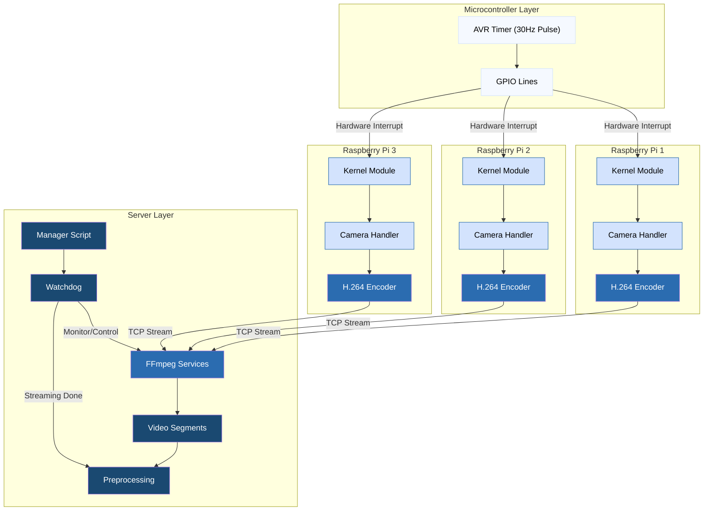

# Multi-Camera Hand Pose Dataset Collection System

This project aims to leverage Google's Mediapipe hand pose predictor, a custom multi-camera enclosure, and triangulation to bootstrap a 3D hand pose dataset at a rate of 108,000 labeled training samples per hour of recording. The ultimate goal is to design a neural net architecture for accurate, real-time, wearable-free hand motion capture.

### Architecture Diagram

### Physical Setup
[Photos/diagrams of recording frame and hardware]

## Technical Components

### Camera Synchronization

The system achieves sub-millisecond frame capture synchronization across multiple cameras using a precise hardware and software stack. An AVR microcontroller generates GPIO interrupts at 30 FPS using its onboard clock, which are processed by a custom Linux kernel module on each Raspberry Pi. The kernel module signals a registered userspace process, which handles the camera control. Precise timing is ensured through FIFO scheduling at maximum priority, running on a fully preemptable kernel (PREEMPT_RT patch). Camera timing determinism is further enhanced by disabling automatic adjustment algorithms and using fixed parameters for exposure, focus, and gain, made possible by the consistent lighting and known capture volume of the recording environment.

### Video Pipeline

The video pipeline is a single-threaded recording application driven by two signal handlers - a design that evolved from multi-threaded versions after finding that cross-core data sharing and additional synchronization complexity reduced performance. When triggered by the kernel module's GPIO interrupt, one handler queues a capture request to the camera. Upon DMA buffer completion, a second handler enqueues the buffer pointer into a lock-free queue for processing. The main loop dequeues these buffers, performs H.264 encoding, and streams the result via TCP to the server's FFmpeg instance. A semaphore tracking queue size prevents busy waiting in the main loop. The lock-free queue design is crucial, allowing the capture completion handler to safely preempt the main loop while preventing data races between components. Once the pipeline is running, timing between capture signal, capture completion, and frame transmission shows sub-millisecond variation, with approximately 8.3ms of idle time between frame transmission and the next capture signal, validating the simplified single-threaded approach. To enable precise timing analysis, a custom async-signal-safe logger captures events directly within signal handlers. Sub-millisecond synchronization is verified through comparing timestamps from these logs across cameras, made possible by NTP synchronization of all Raspberry Pis to the central server.

### Server-Side Pipeline

The server-side pipeline takes advantage of FFmpeg's native support for handling incoming streams, eliminating the need for a conventional server application. The system uses systemd services to handle FFmpeg instances, with a separate service instance for each incoming camera stream. Incoming H.264 streams are recorded using FFmpeg's -segment feature, which creates new files for each segment within a session to allow seamless recovery after interruptions. The streams are transcoded server-side to H.265, leveraging GPU acceleration for efficient compression while minimizing computational load on the Raspberry Pis.

A manager script provides commands to start, stop, restart, and monitor all services. It uses a simple counter stored in a dotfile to enumerate recording sessions, ensuring unique filenames across sessions. The watchdog script manages recording states by first waiting for the creation of an initial segment to confirm that recording has started. Once detected, it monitors progress by using inotify on the latest segment, avoiding false triggers caused by FFmpeg restarting and creating a new segment. When recording ends, it executes the preprocessing script as a background task so it can immediately increment the session counter and restart services to prepare the system for the next session.

### Calibration Pipeline
- Lens distortion correction
- Camera alignment
- Stereo calibration
- Frame validation

## Hardware Setup

### Components
- Camera specifications
- Frame construction
- GPIO wiring
- ArUco markers

### Assembly
- Frame assembly
- Camera mounting
- Electronics installation
- Calibration markers

## Dataset Generation

### Pipeline Overview
- Video preprocessing
- MediaPipe integration
- Multi-view triangulation
- Data format

### Output Format
- Dataset structure
- File formats
- Sample counts
- Data fields

## Results & Examples
[Visual examples of system output, calibration results, etc.]

## License
This project is licensed under the MIT License. See the [LICENSE](LICENSE) file for details.

## Acknowledgments
Any credits or acknowledgments
