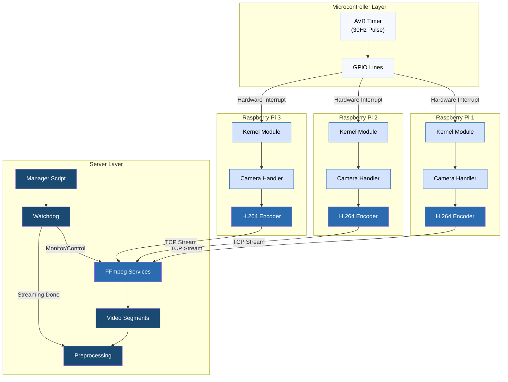

# Multi-Camera Hand Pose Dataset Collection System

This is has been my side project for the past few months. Its purpose is to use Google's Mediapipe hand pose predictor, a custom multi-camera enclosure for data capture, and triangulation to bootstrap a 3d and pose dataset at a rate of 108,000 labeled training samples per hour of recording. It employs an avr microcontroller and three raspberry pis to achieve sub millisecond frame capture synchronization and real-time video encoding and streaming to the server where it undergoes a fully scripted preprocessing pipeline. The ultimate goal is to design a neural net architecture to leverage the dataset for accurate, real-time, wearable-free hand motion capture.

### Architecture Diagram

### Physical Setup
[Photos/diagrams of recording frame and hardware]

## Technical Components

### Camera Synchronization
- GPIO-based hardware sync
- Kernel module
- Real-time scheduling
- Performance characteristics

### Video Pipeline
- Camera capture system
- Real-time encoding
- Network streaming
- File management

### System Management
- Service orchestration
- Process monitoring
- Error handling
- Recovery mechanisms

### Calibration Pipeline
- Lens distortion correction
- Camera alignment
- Stereo calibration
- Frame validation

## Hardware Setup

### Components
- Camera specifications
- Frame construction
- GPIO wiring
- ArUco markers

### Assembly
- Frame assembly
- Camera mounting
- Electronics installation
- Calibration markers

## Dataset Generation

### Pipeline Overview
- Video preprocessing
- MediaPipe integration
- Multi-view triangulation
- Data format

### Output Format
- Dataset structure
- File formats
- Sample counts
- Data fields

## Results & Examples
[Visual examples of system output, calibration results, etc.]

## License
License information

## Acknowledgments
Any credits or acknowledgments
