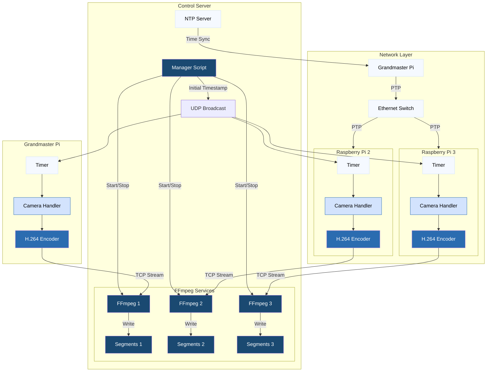

# Multi-Camera Hand Pose Dataset Collection System

This project aims to leverage Google's Mediapipe hand pose predictor, a custom multi-camera enclosure, and triangulation to bootstrap a 3D hand pose dataset at a rate of 108,000 labeled training samples per hour of recording. The ultimate goal is to design a neural net architecture for accurate, real-time, wearable-free hand motion capture.

### Architecture Diagram

### Physical Setup
[Photos/diagrams of recording frame and hardware]

## Technical Components

### Camera Synchronization

The system achieves microsecond-level frame capture synchronization across multiple cameras through a carefully designed network time synchronization architecture. One Raspberry Pi serves as the grandmaster clock, synchronizing via NTP to the control server. The remaining Raspberry Pis use Precision Time Protocol (PTP) to synchronize their system clocks to the grandmaster Pi, creating a highly accurate shared time reference across the capture network. All devices are connected via ethernet to an unmanaged switch to minimize network latency variation.

The synchronization mechanism leverages this precise clock alignment by having the server broadcast an initial timestamp to all cameras. Each camera then calculates subsequent frame capture times by adding frame duration intervals (33.33ms at 30fps) to this common starting point. This approach ensures that even if cameras receive the initial timestamp at slightly different times due to network delays, they will automatically adjust their timing to synchronize with the intended capture schedule.

To maintain precise timing between frames, the system uses a combination of real-time and monotonic clocks. While the PTP-synchronized system clock provides the common time reference needed for coordination, frame intervals are scheduled using the monotonic clock to prevent disruption from any small clock adjustments. The system uses absolute rather than relative timer targets, preventing the accumulation of scheduling delays that could cause timing drift between cameras. Logging analysis shows that this architecture achieves frame capture synchronization within 9 microseconds between cameras, far exceeding the requirements for 30fps video where frames are 33.33ms apart.

### Video Pipeline

The video pipeline is a single-threaded recording application driven by two signal handlers - a design that evolved from multi-threaded versions after finding that cross-core data sharing and additional synchronization complexity reduced performance. When triggered by the timer reaching a target timestamp, one handler queues a capture request to the camera. Upon DMA buffer completion, a second handler enqueues the buffer pointer into a lock-free queue for processing. The main loop dequeues these buffers, performs H.264 encoding, and streams the result via TCP to the server's FFmpeg instance. A semaphore tracking queue size prevents busy waiting in the main loop. The lock-free queue design is crucial, allowing the capture completion handler to safely preempt the main loop while preventing data races between components.

Once the pipeline is running, timing between capture signal, capture completion, and frame transmission shows remarkable consistency, with the system maintaining precise 33.33ms intervals between frames. A timer-based disconnect mechanism closes the TCP connection after 0.3 seconds without new frames, enabling the server to detect recording completion and prepare for the next session. To enable precise timing analysis, a custom async-signal-safe logger captures events directly within signal handlers. Sub-millisecond synchronization is verified through comparing timestamps from these logs across cameras, made possible by the PTP clock synchronization across the capture network.

### Server-Side Pipeline

The server-side pipeline takes advantage of FFmpeg's native support for handling incoming streams, eliminating the need for a conventional server application. The system uses systemd services to handle FFmpeg instances, with a separate service instance listening on a dedicated port for each incoming camera stream. Incoming H.264 streams are recorded using FFmpeg's -segment feature, which creates new files for each segment within a session to allow seamless recovery after interruptions. The streams are transcoded server-side to H.265, leveraging GPU acceleration for efficient compression while minimizing computational load on the Raspberry Pis.

A manager script provides commands to start, stop, restart, and monitor all services. The manager uses a simple counter stored in a dotfile to enumerate recording sessions, ensuring unique filenames across sessions. When launching a new recording session, the manager script broadcasts the initial synchronization timestamp to all cameras via UDP, then starts the FFmpeg services to receive the incoming video streams. The system monitors segment creation to confirm successful recording startup and uses inotify to detect when recording has completed on all cameras.

### Calibration Pipeline
- Lens distortion correction
- Camera alignment
- Stereo calibration
- Frame validation

## Hardware Setup

### Components
- Camera specifications
- Frame construction
- GPIO wiring
- ArUco markers

### Assembly
- Frame assembly
- Camera mounting
- Electronics installation
- Calibration markers

## Dataset Generation

### Pipeline Overview
- Video preprocessing
- MediaPipe integration
- Multi-view triangulation
- Data format

### Output Format
- Dataset structure
- File formats
- Sample counts
- Data fields

## Results & Examples
[Visual examples of system output, calibration results, etc.]

## License
This project is licensed under the MIT License. See the [LICENSE](LICENSE) file for details.

## Acknowledgments
Any credits or acknowledgments
